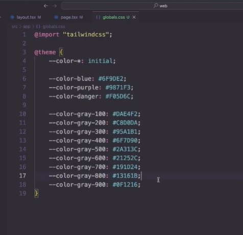

`````````
Install e config 

https://tailwindcss.com/docs/installation/framework-guides/nextjs

npm install tailwindcss @tailwindcss/postcss postcss


file: postcss.config.mjs
const config = {
  plugins: {
    "@tailwindcss/postcss": {},
  },
};

export default config;


file: globals.css

@import "tailwindcss";

e em Layout 

``````````

`````````
* Este comando => --color-*: initial faz com que o tailwind só apresente para uso as cores que colocamos assim inpedindo erros ou incoerencias

@theme{
  --color-*: initial
}
`````````





```````
@theme {
  --color-*: initial;

  --color-blue: #6F9DE2;
  --color-purple: #9871F3;

  --color-danger: #F05D6C;

  --color-gray-100: #DAE4F2;
  --color-gray-200: #C8D0DA;
  --color-gray-300: #95A1B1;
  --color-gray-400: #6F7D90;
  --color-gray-500: #2A313C;
  --color-gray-600: #21252C;
  --color-gray-700: #191D24;
  --color-gray-800: #13161B;
  --color-gray-900: #0F1216;

  --font-heading: var(--font-oxanium);
  --font-sans: var(--font-montserrat);  ---> IMPORTANTE sempre que colocar font-sans esta font será considerada padrão do projeto pelo tailwind então não preciso chamar ela nos componentes

  --radius-xl: 0.625rem;
}


layout.tsx
import './global.css'

import type { Metadata } from 'next'
import { Montserrat, Oxanium } from 'next/font/google'  ==> chamo as fonts do google

export const metadata: Metadata = {
  title: 'devstage',
}

const oxanium = Oxanium({  ==> uso ela como funções 
  weight: ['500', '600'],   ==> tamanho
  subsets: ['latin'],       ==> subsets peso 
  variable: '--font-oxanium',  ===> torno uma variavel 
})

const montserrat = Montserrat({
  weight: ['400', '600'],
  subsets: ['latin'],
  variable: '--font-montserrat',
})

/**
        Com isso torno as variaveis acessiveis para serem usada no global.css
   <html lang="en" className={`${oxanium.variable} ${montserrat.variable}`}>
*/


export default function RootLayout({
  children,
}: Readonly<{
  children: React.ReactNode;
}>) {
  return (
    <html lang="en">
      <body>{children}</body>
    <html lang="en" className={`${oxanium.variable} ${montserrat.variable}`}>
      <body className="bg-gray-900 text-gray-100 antialiased bg-[url(/background.png)] bg-no-repeat md:bg-right-top bg-top">
        {children}
      </body>
    </html>
  );
}

```````